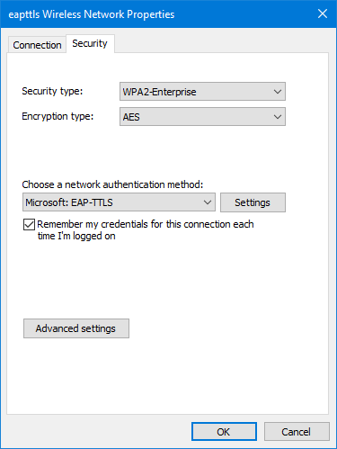
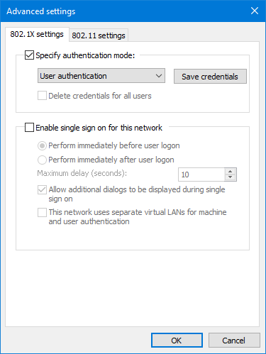

# EAP TTLS authentication

This helps quick setup EAP TTLS for testing WPA2-Enterprise EAP TTLS. User authentication by ldap (LDAP TLS in TLS tunnel)
[FreeRadius](https://github.com/FreeRADIUS/freeradius-server) service it. Configs for v3.0.x.
[Openldap](https://git.openldap.org/openldap/openldap) service via ldaps/ldap. Configs for v1.5.0.


## Quick start

```bash
git clone https://github.com/tknv/docker-radius-eap-ttls.git EAP-TTLS
cd EAP-TTLS
docker-compose up
```

Install Root CA by double click(usually) `ca.crt` in EAP-TTLS directory.

## Usage

* Radius is listening on port 1812 UDP.
* A secret for Radius server connection is `symbol123`
    * It usually set it at Access Point.
* A password for all private key is `symbol`

### Install CA to client machine/device

#### Windows

Install CA by double click `ca.crt`. And goto **Control Panel > All Control Panel Items > Network and Sharing Center > Manually connect or Network**.  
**Network name** should be SSID (if use EAP TLS auth for wireless client). **Security type** `WPA2-Enterprise`. Then Next. Change connection settings comes and click it.

At pop up. XXXX Wireless Network Properties.  
  
Choose a network authentication method: Microsoft: EAP-TTLS  
  
Settings > tick Enable identity privacy  
Trusted Root Certification Authorities:  
  tick AWASLab  
Select a non-EAP method for authentication  
Unencrypted password (PAP) for now. But others also fine (need configure). E.g. Select an EAP method for authentication with EAP-TLS.  
  
Then back to the pop up and Advanced settings > tick specify authentication mode:  
  
User authentication > Save credentials.  
**User account** is `tknv`, `symbol`, it's in LDAP directory. Created by `bootstrap/idif/tknv.ldif`.
  

Auth user file user `tknv@awas.lab`, `symbol123`, it's in `user` file. [To create/edit](#createedit-user)  

### Linux

#### WPA2-Enterprise (EAP TTLS)

`sudo wpa_supplicant -dd -c ./wpa2_supplicant.conf -i wlo1`

wlo1 is wireless interface. `ssid` is vary, change to AP's. 

## Configuration

Customize `inner-tunnel` to change/add auth type in TLS tunnel.

### Use Azure Active Directory instead of openldap

Edit `ldap` file to below.

```bash
 ldap {
        server = 'yourAADDSdomain.onmicrosoft.com'
        #the identity user should be a member of you AADDS admin group
        identity = 'user@yourAADDSdomain.onmicrosoft.com' 
        password = 'yourpassword'
        basedn = 'OU=AADDC Users,dc=yourAADDSdomain,dc=onmicrosoft,dc=com'
        user {
           filter = “(userPrincipalName=%{%{Stripped-User-Name}:-%{User-Name}})”
        }
    }
```

by [stackoverflow.com](https://stackoverflow.com/questions/40747952/freeradius-authentication-through-azure-active-directory)

## See also

[easy-rsa](https://github.com/OpenVPN/easy-rsa/) can quickly generate your certificates and keys.

## WARNING

This is for lab use only. **Not secure at all.**
Better not touch certs directory all.
